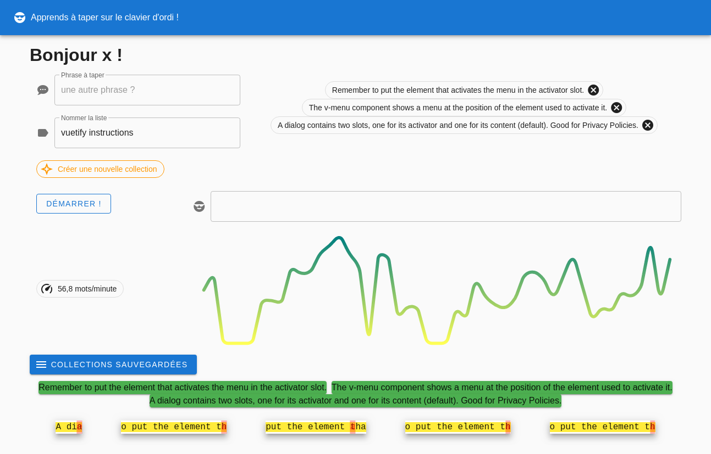

# typing

Une petite application pour permettre d'apprendre la dactylographie. J'ai utilisé [vue.js](https://vuejs.org) et [vuetify](https://vuetifyjs.com/) pour l'initialisation. Pour afficher les erreurs de frappe, j'ai utilisé [diff](https://www.npmjs.com/package/diff).



## Project setup
```
yarn install
```

### Compiles and hot-reloads for development
```
yarn serve
```

### Compiles and minifies for production
```
yarn build
```

### Lints and fixes files
```
yarn lint
```

### Customize configuration
See [Configuration Reference](https://cli.vuejs.org/config/).
